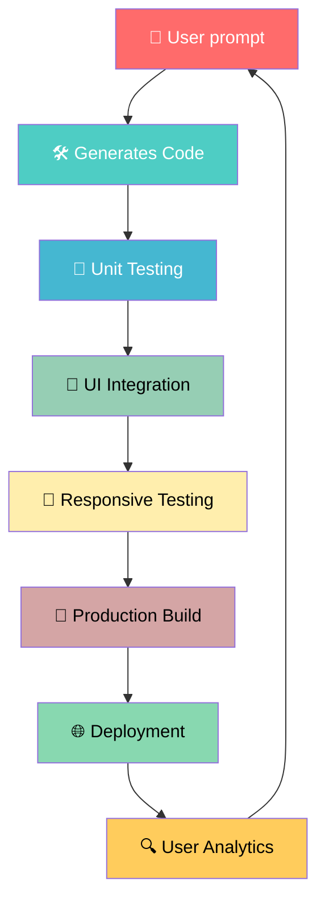

# Wesbyte

### ✨ Overview

> A production-ready AI-powered no-code website builder built with Next.js and React. Users can generate full websites from prompts, refine them with AI, and then fully customize layouts using a professional drag-and-drop visual editor & no coding required.


<div align="center">

[](https://github.com/hallofcodes/wesbyte/blob/main/LICENSE)
[](https://github.com/hallofcodes/wesbyte/stargazers)
[](https://github.com/hallofcodes/wesbyte/issues)
[](https://wesbyte.hollofcodes.com)


**Next-Gen AI No-Code Website Creation Platform**

</div>

## 🚀 Quick Start

### Prerequisites
- Node.js 16.x+
- npm 8.x+

### Installation
```bash
# Clone repository
git clone https://github.com/hallofcodes/wesbyte.git

# Navigate to project directory
cd wesbyte

# Install dependencies
npm install

# Start development server
npm run dev
```


## 🔄 Development Workflow



---

## 🧩 Feature Overview

- 🧠 AI-powered website generation from prompts
- 💬 Chat-based iterative design refinement
- 🖌️ Fully visual drag-and-drop editor
- 🧱 Component-based architecture system
- 📱 Responsive design preview modes
- 🎨 Theme, typography, and layout customization
- 🧠 AI copywriting + design assistant
- ⚡ Export to clean React/Next.js code
- 🚀 One-click deployment support

---

## 📄 License
MIT License - free to use, modify, and extend.

---


<div align="center">©2026 Hall of Codes - Samiun Nafis</div>
